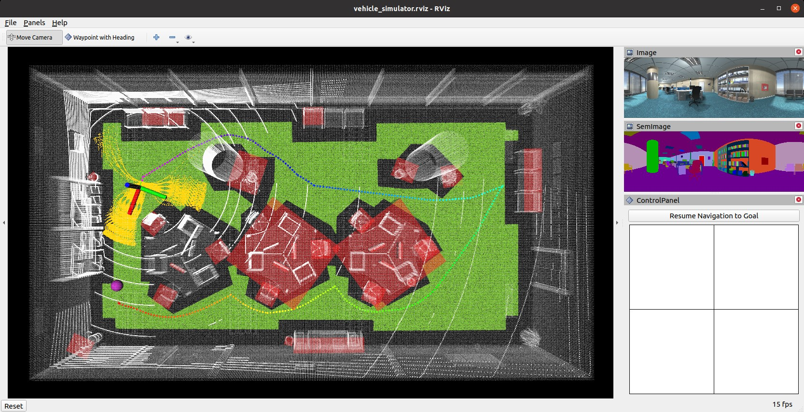

## Repository Setup

The repository provides the base navigation system for the [CMU Vision-Language-Autonomy Challenge](https://www.ai-meets-autonomy.com/cmu-vla-challenge). The system is integrated with [Unity](https://unity.com) environment models. The repository has been tested in Ubuntu 20.04 with [ROS Noetic](http://wiki.ros.org/noetic/Installation). Install dependencies with the command lines below.
```
sudo apt update
sudo apt install libusb-dev python-yaml python-is-python3
```
Clone the open-source repository.
```
git clone https://github.com/jizhang-cmu/cmu_vla_challenge_unity.git
```
In a terminal, go to the folder and compile.
```
cd cmu_vla_challenge_unity
catkin_make
```
Download any of our [Unity environment models](https://drive.google.com/drive/folders/1bmxdT6Oxzt0_0tohye2br7gqTnkMaq20?usp=share_link) and unzip the files to the 'src/vehicle_simulator/mesh/unity' folder. The environment model files should look like below. Note that the 'AssetList.csv' file is generated upon start of the system.

mesh/<br>
&nbsp;&nbsp;&nbsp;&nbsp;unity/<br>
&nbsp;&nbsp;&nbsp;&nbsp;&nbsp;&nbsp;&nbsp;&nbsp;environment/<br>
&nbsp;&nbsp;&nbsp;&nbsp;&nbsp;&nbsp;&nbsp;&nbsp;&nbsp;&nbsp;&nbsp;&nbsp;Model_Data/ (multiple files in the folder)<br>
&nbsp;&nbsp;&nbsp;&nbsp;&nbsp;&nbsp;&nbsp;&nbsp;&nbsp;&nbsp;&nbsp;&nbsp;Model.x86_64<br>
&nbsp;&nbsp;&nbsp;&nbsp;&nbsp;&nbsp;&nbsp;&nbsp;&nbsp;&nbsp;&nbsp;&nbsp;UnityPlayer.so<br>
&nbsp;&nbsp;&nbsp;&nbsp;&nbsp;&nbsp;&nbsp;&nbsp;&nbsp;&nbsp;&nbsp;&nbsp;AssetList.csv (generated at runtime)<br>
&nbsp;&nbsp;&nbsp;&nbsp;&nbsp;&nbsp;&nbsp;&nbsp;&nbsp;&nbsp;&nbsp;&nbsp;Dimensions.csv<br>
&nbsp;&nbsp;&nbsp;&nbsp;&nbsp;&nbsp;&nbsp;&nbsp;&nbsp;&nbsp;&nbsp;&nbsp;Categories.csv<br>
&nbsp;&nbsp;&nbsp;&nbsp;&nbsp;&nbsp;&nbsp;&nbsp;map.ply<br>
&nbsp;&nbsp;&nbsp;&nbsp;&nbsp;&nbsp;&nbsp;&nbsp;object_list.txt<br>
&nbsp;&nbsp;&nbsp;&nbsp;&nbsp;&nbsp;&nbsp;&nbsp;traversable_area.ply<br>
&nbsp;&nbsp;&nbsp;&nbsp;&nbsp;&nbsp;&nbsp;&nbsp;map.jpg<br>
&nbsp;&nbsp;&nbsp;&nbsp;&nbsp;&nbsp;&nbsp;&nbsp;render.jpg<br>

## System Launch

In a terminal, go to the 'cmu_vla_challenge_unity' folder and bring up the system.
```
./system_bring_up.sh
```
Users should see data showing up in RVIZ. Click 'Panels->Display' and check the data to view. Users can also use the 'Waypoint with Heading' button to navigate the vehicle. **To set the waypoint, press the left button on the mouse to choose the position, then move the mouse to choose the orientation before releasing the left button.** The vehicle will navigate to the waypoint avoiding collisions on the way and then turn to the orientation. Note that the waypoints are meant to be relatively close to the vehicle. Setting the waypoint too far can cause the vehicle to stuck at a dead end.

<p align="center">
  
</p>

Users can also use the control panel to navigate the vehicle by clicking inside the black box. The system will switch to *smart joystick* mode - the vehicle tries to follow the joystick command and avoid collisions at the same time. To resume waypoint navigation, press the 'Resume Navigation to Goal' button. Note that users can use a PS3/4 or Xbox controller with a USB or Bluetooth interface instead of the virtual joystick (If using the Xbox Wireless USB Adapter, please install [xow](https://github.com/medusalix/xow)). Users can use the right joystick on the controller to navigate the vehicle. Holding the obstacle-check button cancels obstacle checking and clicking the clear-terrain-map button reinitializes the terrain map. To resume waypoint navigation, hold the mode-switch button and at the same time push the right joystick. This way, the right joystick gives the speed. If only holding the mode-switch button, the system will use the default speed.

<p align="center">
  
  &nbsp;&nbsp;&nbsp;&nbsp;
  
</p>

**Troubleshooting** - If the system does not launch correctly, users can launch the Unity environment and the autonomy system in two separate terminals. In a terminal, go to the 'cmu_vla_challange_unity' folder and launch the Unity environment.
```
./src/vehicle_simulator/mesh/unity/environment/Model.x86_64
```
In a second terminal, go to the 'cmu_vla_challange_unity' folder and bring up the autonomy system.

```
source devel/setup.sh  
roslaunch vehicle_simulator system_unity.launch 
```

## Credits

[ROS-TCP-Endpoint](https://github.com/Unity-Technologies/ROS-TCP-Endpoint) and [joystick_drivers](http://wiki.ros.org/joystick_drivers) packages are from open-source releases.

## Relevant Links

The repository is based on [Autonomous Exploration Development Environment](https://www.cmu-exploration.com).

[Far Planner](https://github.com/MichaelFYang/far_planner): a visibility graph-based route planner.
